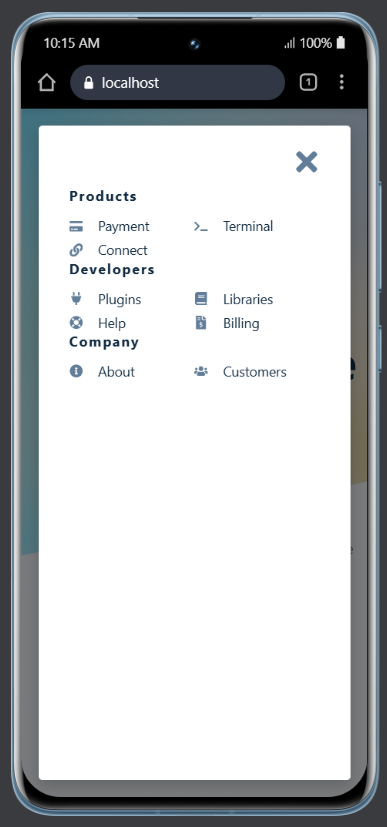
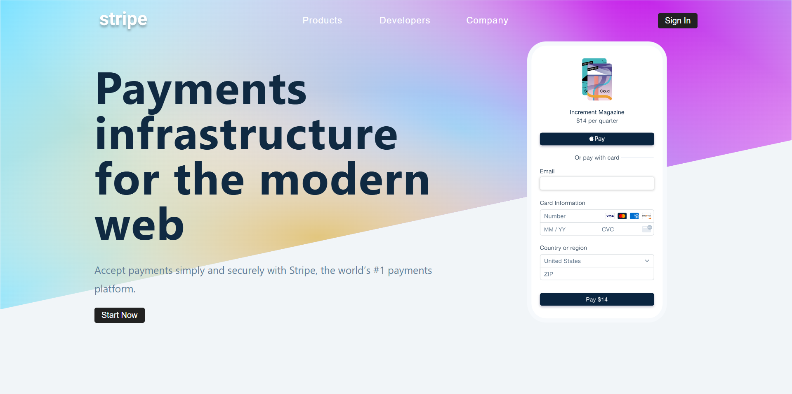

# Stripe Mega Menu Replica

A high-fidelity recreation of Stripe's iconic, fluid navigation menu built with React and modern animation libraries.

## Features

- **Dynamic Dropdowns**: Smoothly transitioning menu panels that morph their dimensions based on content.
- **Interactive Hover States**: Seamless animations and transitions when switching between navigation items.
- **Responsive Design**: Fully optimized for desktop, tablet, and mobile viewports.
- **Accessible Navigation**: Built with accessibility best practices to ensure a usable experience for everyone.

## Screenshots

Below are the visual representations of the navigation flow:





## Getting Started

### Prerequisites

- Node.js (v14 or higher)
- npm or yarn

### Installation

1. **Clone the repository**:
   ```bash
   git clone <repository-url>
   ```

2. **Install dependencies**:
   ```bash
   npm install
   ```

3. **Start the application**:
   ```bash
   npm start
   ```

## Technologies Used

- **Frontend**: React.js
- **Animations**: Framer Motion
- **Styling**: Tailwind CSS / Styled Components
