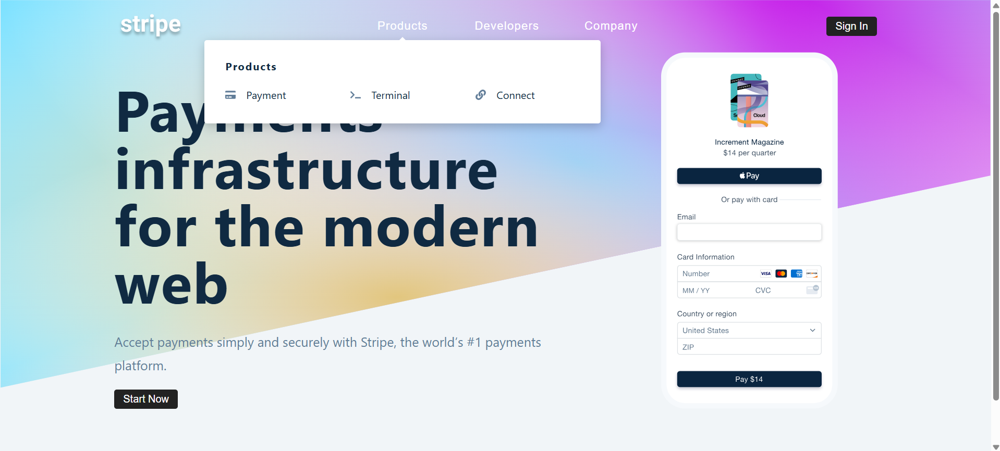

# Stripe Mega Menu Replica

A high-fidelity recreation of Stripe's iconic, fluid navigation menu built with React and modern animation libraries.

## Features

- **Dynamic Dropdowns**: Smoothly transitioning menu panels that morph their dimensions based on content.
- **Interactive Hover States**: Seamless animations and transitions when switching between navigation items.
- **Responsive Design**: Fully optimized for desktop, tablet, and mobile viewports.
- **Accessible Navigation**: Built with accessibility best practices to ensure a usable experience for everyone.

## Screenshots

Below are the visual representations of the navigation flow:
| State | Mobile | Desktop |
| :--- | :---: | :---: |
| **Closed** |  |  |
| **Open** |  |  |

## Getting Started

### Prerequisites

- Node.js (v14 or higher)
- npm or yarn

### Installation

1. **Clone the repository**:
   ```bash
   git clone <repository-url>
   ```

2. **Install dependencies**:
   ```bash
   npm install
   ```

3. **Start the application**:
   ```bash
   npm start
   ```

---

## 🤝 Community & Contributions

Contributions are what make the open-source community such an amazing place to learn, inspire, and create. Any contributions you make are **greatly appreciated**.

- **Code of Conduct**: Please read our [Code of Conduct](CODE_OF_CONDUCT.md) to understand the standards of behavior we expect in our community.
- **Contributing**: Check out the [Contributing Guidelines](CONTRIBUTING.md) for details on our code of conduct and the process for submitting pull requests.
- **Security**: Please refer to our [Security Policy](SECURITY.md).
- **Issue Templates**: When opening an issue, please use the provided [Bug Report](.github/ISSUE_TEMPLATE/bug_report.md) or [Feature Request](.github/ISSUE_TEMPLATE/feature_request.md) templates.

---

## 📜 License

Distributed under the MIT License. See `LICENSE` for more information.
